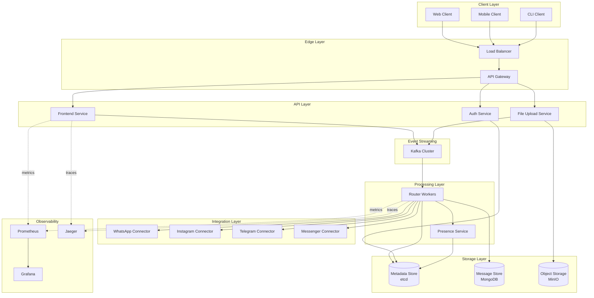
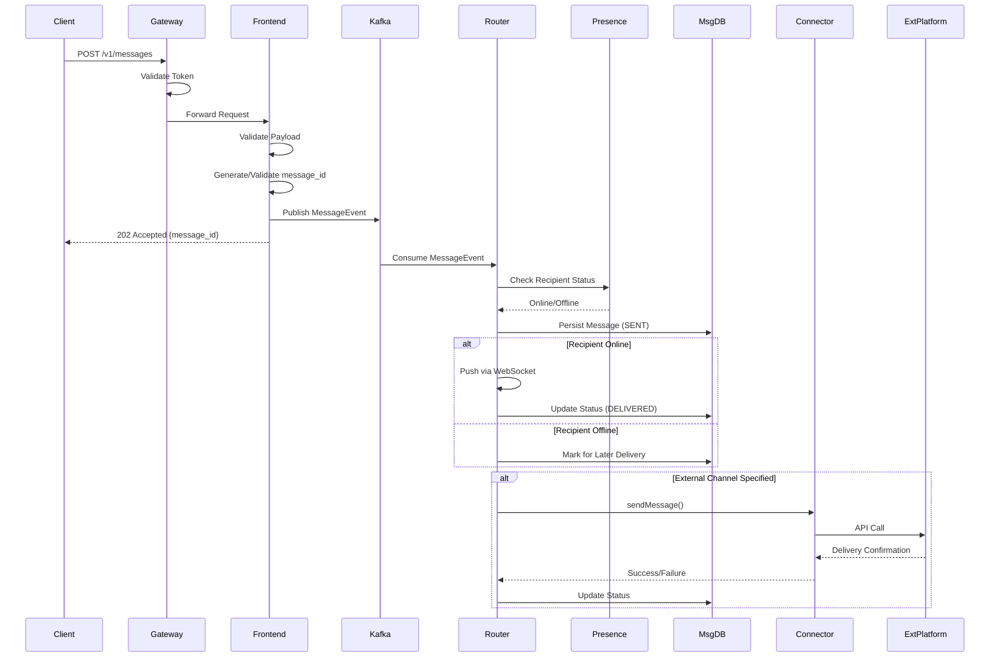

# Design Document - Plataforma de Comunicação Ubíqua

## Overview

A plataforma de comunicação ubíqua é um sistema distribuído que atua como broker/unificador de mensagens entre múltiplas plataformas externas (WhatsApp, Instagram Direct, Telegram, Messenger) e clientes internos. O design segue uma arquitetura de microserviços com componentes stateless para escalabilidade horizontal, event-driven architecture para processamento assíncrono, e padrões de resiliência para alta disponibilidade.

### Design Principles

1. **Separation of Concerns**: Cada componente tem responsabilidade única e bem definida
2. **Stateless Services**: APIs e workers não mantêm estado de sessão, permitindo escala horizontal
3. **Event-Driven**: Comunicação assíncrona via message broker para desacoplamento e resiliência
4. **Idempotency**: Todas as operações são idempotentes usando message_id para deduplicação
5. **Fail-Fast & Circuit Breaking**: Isolamento de falhas para evitar cascata
6. **Observability-First**: Tracing, metrics e logs estruturados em todos os componentes

## Architecture

### High-Level Architecture Diagram



### Component Interaction Flow

**Message Send Flow:**


## Components and Interfaces

### 1. API Gateway

**Responsibilities:**
- TLS termination
- Authentication token validation
- Rate limiting per client
- Request routing to backend services
- CORS handling

**Technology:** Nginx or Kong

**Configuration:**
- Rate limit: 1000 req/min per client_id
- Timeout: 30s for API calls
- TLS 1.3 only

### 2. Frontend Service

**Responsibilities:**
- Expose REST API endpoints
- Request validation (schema, business rules)
- Message_id generation/validation
- Event publishing to Kafka
- Synchronous response to clients

**API Endpoints:**

```
POST /v1/auth/register
POST /v1/auth/token
POST /v1/conversations
GET /v1/conversations/{conversation_id}/messages
POST /v1/messages
GET /v1/messages/{message_id}/status
POST /v1/webhooks
DELETE /v1/webhooks/{webhook_id}
```

**Technology:** Go or Node.js (TypeScript)

**Interface:**
```go
type FrontendService interface {
    CreateConversation(ctx context.Context, req CreateConversationRequest) (*Conversation, error)
    SendMessage(ctx context.Context, req SendMessageRequest) (*MessageResponse, error)
    GetMessageStatus(ctx context.Context, messageID string) (*MessageStatus, error)
    RegisterWebhook(ctx context.Context, req WebhookRequest) (*Webhook, error)
}
```

### 3. Auth Service

**Responsibilities:**
- User registration with username uniqueness validation
- Credential validation
- JWT token generation and validation
- Token refresh
- User-to-channel mapping management

**Technology:** Go with JWT libraries

**Data Model:**
```go
type User struct {
    Username      string    `json:"username"`
    PasswordHash  string    `json:"-"`
    CreatedAt     time.Time `json:"created_at"`
    ChannelMappings []ChannelMapping `json:"channel_mappings"`
}

type ChannelMapping struct {
    Channel      string `json:"channel"` // "whatsapp", "instagram", etc
    ExternalID   string `json:"external_id"`
    Verified     bool   `json:"verified"`
}
```

### 4. File Upload Service

**Responsibilities:**
- Initiate resumable uploads (generate presigned URLs)
- Handle chunked uploads
- Validate checksums
- Store files in Object Storage
- Persist file metadata

**Technology:** Go with MinIO SDK

**Upload Flow:**
1. Client calls `POST /v1/files/initiate` → receives `upload_url` and `file_id`
2. Client uploads chunks to presigned URL (multipart)
3. Client calls `POST /v1/files/complete` with checksum
4. Service validates and finalizes

**Interface:**
```go
type FileService interface {
    InitiateUpload(ctx context.Context, req InitiateUploadRequest) (*UploadSession, error)
    CompleteUpload(ctx context.Context, fileID string, checksum string) (*FileMetadata, error)
    GetFileMetadata(ctx context.Context, fileID string) (*FileMetadata, error)
}
```

### 5. Message Broker (Kafka)

**Responsibilities:**
- Durable event streaming
- Partitioning by conversation_id for ordering
- Event replay capability
- At-least-once delivery guarantee

**Topics:**
- `message.events` - New messages
- `message.status` - Status updates (DELIVERED, READ)
- `file.events` - File upload completions
- `presence.events` - User online/offline events

**Partitioning Strategy:**
- Partition key: `conversation_id`
- Number of partitions: 50 (adjustable based on load)

**Retention:**
- 7 days for message events
- 30 days for status events

### 6. Router Workers

**Responsibilities:**
- Consume events from Kafka
- Query Presence Service for recipient status
- Persist messages to Message Store
- Route to internal clients (WebSocket/push)
- Invoke Connectors for external channels
- Handle retries with exponential backoff
- Update message status
- Deduplicate based on message_id

**Technology:** Go (high concurrency)

**Scaling:**
- Horizontal scaling via Kafka consumer groups
- Each worker handles multiple partitions
- Auto-scale based on consumer lag

**Interface:**
```go
type RouterWorker interface {
    ProcessMessageEvent(ctx context.Context, event MessageEvent) error
    ProcessStatusEvent(ctx context.Context, event StatusEvent) error
    RouteToChannel(ctx context.Context, msg Message, channel string) error
}
```

**Deduplication Logic:**
```go
func (r *RouterWorker) ProcessMessageEvent(ctx context.Context, event MessageEvent) error {
    // Check if message_id already processed
    exists, err := r.msgStore.MessageExists(ctx, event.MessageID)
    if err != nil {
        return err
    }
    if exists {
        log.Info("Duplicate message detected", "message_id", event.MessageID)
        return nil // Idempotent - already processed
    }
    
    // Continue with processing...
}
```

### 7. Presence Service

**Responsibilities:**
- Track user online/offline status
- Maintain active connections registry
- Provide real-time presence queries
- Emit presence change events

**Technology:** Redis for fast lookups + Go service

**Data Structure:**
```
Key: presence:{username}
Value: {
    "status": "online|offline",
    "last_seen": "2025-11-29T10:30:00Z",
    "connections": ["conn_id_1", "conn_id_2"]
}
TTL: 5 minutes (refreshed by heartbeats)
```

**Interface:**
```go
type PresenceService interface {
    SetOnline(ctx context.Context, username string, connID string) error
    SetOffline(ctx context.Context, username string, connID string) error
    IsOnline(ctx context.Context, username string) (bool, error)
    GetPresence(ctx context.Context, username string) (*PresenceInfo, error)
}
```

### 8. Connectors (Channel Adapters)

**Responsibilities:**
- Implement standardized Connector interface
- Translate platform messages to external channel format
- Handle channel-specific authentication
- Implement retry logic with circuit breaker
- Process webhooks from external platforms
- Report delivery status back to Router

**Standardized Interface:**
```go
type Connector interface {
    Connect(ctx context.Context, config ChannelConfig) error
    SendMessage(ctx context.Context, msg OutboundMessage) (*DeliveryResult, error)
    SendFile(ctx context.Context, file OutboundFile) (*DeliveryResult, error)
    HandleWebhook(ctx context.Context, payload []byte) (*WebhookEvent, error)
    Disconnect(ctx context.Context) error
}

type OutboundMessage struct {
    MessageID       string
    RecipientID     string // External platform user ID
    Text            string
    Metadata        map[string]string
}

type DeliveryResult struct {
    Success         bool
    ExternalID      string // Platform's message ID
    Error           error
    RetryAfter      *time.Duration
}
```

**Connector Implementations:**

**WhatsApp Connector:**
- Uses WhatsApp Business API
- Requires business account and API key
- Supports text and media messages
- Webhook for delivery receipts

**Instagram Connector:**
- Uses Instagram Graph API (Direct)
- Requires Facebook App credentials
- Limited to verified business accounts

**Telegram Connector:**
- Uses Telegram Bot API
- Simpler integration (bot token)
- Supports groups and channels

**Messenger Connector:**
- Uses Facebook Messenger Platform API
- Requires Facebook App and page access token

**Circuit Breaker Pattern:**
```go
type CircuitBreaker struct {
    maxFailures   int
    timeout       time.Duration
    state         State // CLOSED, OPEN, HALF_OPEN
    failures      int
    lastFailTime  time.Time
}

func (cb *CircuitBreaker) Call(fn func() error) error {
    if cb.state == OPEN {
        if time.Since(cb.lastFailTime) > cb.timeout {
            cb.state = HALF_OPEN
        } else {
            return ErrCircuitOpen
        }
    }
    
    err := fn()
    if err != nil {
        cb.failures++
        cb.lastFailTime = time.Now()
        if cb.failures >= cb.maxFailures {
            cb.state = OPEN
        }
        return err
    }
    
    cb.failures = 0
    cb.state = CLOSED
    return nil
}
```

### 9. Message Store (MongoDB)

**Responsibilities:**
- Persist message metadata and text
- Store conversation metadata
- Maintain message status history
- Support queries by conversation_id, message_id, username
- Provide indexes for fast lookups

**Schema:**

**Messages Collection:**
```json
{
  "_id": "msg_uuid_v4",
  "conversation_id": "conv_uuid",
  "from": "username_sender",
  "to": ["username_recipient1", "username_recipient2"],
  "payload": {
    "type": "text|file",
    "text": "message content",
    "file_id": "file_uuid" // if type=file
  },
  "channels": ["whatsapp", "instagram"],
  "status": "SENT|DELIVERED|READ",
  "status_history": [
    {"status": "SENT", "timestamp": "2025-11-29T10:00:00Z"},
    {"status": "DELIVERED", "timestamp": "2025-11-29T10:00:05Z"}
  ],
  "sequence_number": 42, // per conversation
  "created_at": "2025-11-29T10:00:00Z",
  "metadata": {}
}
```

**Conversations Collection:**
```json
{
  "_id": "conv_uuid",
  "type": "private|group",
  "members": ["username1", "username2"],
  "created_at": "2025-11-29T09:00:00Z",
  "last_message_at": "2025-11-29T10:00:00Z",
  "metadata": {}
}
```

**Files Collection:**
```json
{
  "_id": "file_uuid",
  "filename": "document.pdf",
  "size": 1048576,
  "checksum": "sha256_hash",
  "storage_url": "s3://bucket/path/to/file",
  "uploaded_by": "username",
  "uploaded_at": "2025-11-29T10:00:00Z",
  "metadata": {}
}
```

**Indexes:**
- `conversation_id + sequence_number` (unique, for ordering)
- `message_id` (unique)
- `from` (for sender queries)
- `to` (for recipient queries)
- `created_at` (for time-based queries)

**Replication:**
- 3-node replica set
- Write concern: majority
- Read preference: primaryPreferred

### 10. Metadata Store (etcd)

**Responsibilities:**
- Store system configuration
- Maintain user-to-channel mappings
- Service discovery
- Distributed coordination
- Leader election for workers

**Data:**
- User profiles and channel mappings
- Connector configurations
- Feature flags
- Rate limit configurations

### 11. Object Storage (MinIO)

**Responsibilities:**
- Store files up to 2GB
- Provide presigned URLs for uploads
- Support multipart uploads
- Serve files via presigned download URLs

**Bucket Structure:**
```
chat-files/
  ├── 2025/
  │   ├── 11/
  │   │   ├── 29/
  │   │   │   ├── {file_uuid}
```

**Configuration:**
- Replication: 3 copies across nodes
- Erasure coding for durability
- Lifecycle policy: archive after 90 days

## Data Models

### Core Entities

**User:**
```typescript
interface User {
  username: string;
  password_hash: string;
  created_at: Date;
  channel_mappings: ChannelMapping[];
}

interface ChannelMapping {
  channel: string; // "whatsapp", "instagram", etc
  external_id: string;
  verified: boolean;
}
```

**Conversation:**
```typescript
interface Conversation {
  id: string;
  type: "private" | "group";
  members: string[]; // usernames
  created_at: Date;
  last_message_at: Date;
  metadata: Record<string, any>;
}
```

**Message:**
```typescript
interface Message {
  id: string; // message_id (UUID)
  conversation_id: string;
  from: string; // username
  to: string[]; // usernames
  payload: MessagePayload;
  channels: string[]; // ["whatsapp", "instagram"] or ["all"]
  status: MessageStatus;
  status_history: StatusHistoryEntry[];
  sequence_number: number;
  created_at: Date;
  metadata: Record<string, any>;
}

interface MessagePayload {
  type: "text" | "file";
  text?: string;
  file_id?: string;
}

type MessageStatus = "SENT" | "DELIVERED" | "READ";

interface StatusHistoryEntry {
  status: MessageStatus;
  timestamp: Date;
}
```

**File:**
```typescript
interface FileMetadata {
  id: string;
  filename: string;
  size: number;
  checksum: string;
  storage_url: string;
  uploaded_by: string;
  uploaded_at: Date;
  metadata: Record<string, any>;
}
```

## Error Handling

### Error Categories

1. **Client Errors (4xx)**
   - 400 Bad Request: Invalid payload
   - 401 Unauthorized: Invalid/missing token
   - 404 Not Found: Resource doesn't exist
   - 409 Conflict: Username already exists
   - 429 Too Many Requests: Rate limit exceeded

2. **Server Errors (5xx)**
   - 500 Internal Server Error: Unexpected error
   - 503 Service Unavailable: Dependency failure
   - 504 Gateway Timeout: Upstream timeout

### Error Response Format

```json
{
  "error": {
    "code": "INVALID_PAYLOAD",
    "message": "Missing required field: conversation_id",
    "details": {
      "field": "conversation_id"
    },
    "trace_id": "abc123"
  }
}
```

### Retry Strategy

**Exponential Backoff:**
```
Attempt 1: immediate
Attempt 2: 1s delay
Attempt 3: 2s delay
Attempt 4: 4s delay
Attempt 5: 8s delay
Max attempts: 5
```

**Retry Conditions:**
- Network errors
- 5xx responses from external APIs
- Timeout errors
- Circuit breaker HALF_OPEN state

**No Retry:**
- 4xx client errors
- Authentication failures
- Invalid message format

### Dead Letter Queue

Messages that fail after max retries go to DLQ for manual investigation:
- Kafka topic: `message.dlq`
- Retention: 30 days
- Alerting on DLQ growth

## Testing Strategy

### Unit Tests

**Coverage Target:** 80%

**Focus Areas:**
- Business logic in services
- Data validation
- Message deduplication logic
- Status transition logic
- Connector interface implementations

**Tools:** Go testing package, testify for assertions

### Integration Tests

**Scenarios:**
1. End-to-end message flow (client → API → Kafka → Router → DB)
2. File upload and download
3. Webhook delivery
4. Presence tracking
5. Cross-channel routing

**Tools:** Docker Compose for dependencies, Go integration tests

### Load Tests

**Scenarios:**
1. Sustained load: 100k messages/min for 10 minutes
2. Spike test: 0 → 200k messages/min in 1 minute
3. Concurrent file uploads: 1000 simultaneous 100MB uploads

**Tools:** k6 or Gatling

**Metrics to Monitor:**
- Throughput (messages/sec)
- Latency (p50, p95, p99)
- Error rate
- Resource utilization (CPU, memory, disk I/O)

### Chaos Testing

**Scenarios:**
1. Kill random Router Worker pod
2. Partition Kafka broker
3. Slow down MongoDB responses
4. Disconnect external connector

**Expected Behavior:**
- No message loss (at-least-once guarantee)
- Automatic failover within 30s
- Degraded but functional service

**Tools:** Chaos Mesh or Litmus

### Security Testing

**Areas:**
1. Authentication bypass attempts
2. SQL/NoSQL injection
3. Rate limit enforcement
4. Token expiration
5. File upload validation (malicious files)

## Performance Considerations

### Latency Targets

- API response (sync): < 200ms (p95)
- Message delivery (internal): < 500ms (p95)
- Message delivery (external): < 5s (p95, depends on external API)
- File upload initiation: < 100ms
- Presence query: < 50ms

### Throughput Targets

- Messages: 100k/min minimum (1,667/sec)
- File uploads: 1000 concurrent
- API requests: 10k/sec

### Scalability Design

**Horizontal Scaling:**
- Frontend Service: stateless, scale to N instances
- Router Workers: Kafka consumer group, scale to N instances
- Connectors: independent services, scale per channel

**Vertical Scaling:**
- MongoDB: increase replica set size
- Kafka: add brokers and partitions
- MinIO: add storage nodes

**Caching Strategy:**
- User profiles: Redis cache (TTL 5 min)
- Presence data: Redis (TTL 5 min with heartbeat refresh)
- Conversation metadata: Redis cache (TTL 10 min)

### Resource Estimates (for 1M active users)

**Compute:**
- Frontend Service: 10 instances (4 vCPU, 8GB RAM each)
- Router Workers: 20 instances (4 vCPU, 8GB RAM each)
- Connectors: 5 instances per channel (2 vCPU, 4GB RAM each)

**Storage:**
- MongoDB: 500GB (messages + metadata)
- MinIO: 10TB (files)
- Kafka: 1TB (7-day retention)

**Network:**
- Ingress: 1 Gbps
- Egress: 2 Gbps (external API calls)

## Security Considerations

### Authentication & Authorization

- JWT tokens with 1-hour expiration
- Refresh tokens with 30-day expiration
- Token rotation on refresh
- Username/password with bcrypt hashing (cost factor 12)

### Data Protection

- TLS 1.3 for all external communication
- mTLS between internal services (optional, recommended)
- Encryption at rest for MongoDB and MinIO
- Secrets management via Kubernetes Secrets or Vault

### Rate Limiting

- Per-user: 100 messages/min
- Per-IP: 1000 requests/min
- Per-client_id: 10k requests/min

### Input Validation

- Schema validation for all API requests
- File type validation (whitelist)
- File size limits (2GB max)
- Message text length limits (10k characters)

### Audit Logging

- Log all authentication attempts
- Log all message sends with trace_id
- Log all file uploads
- Log all admin actions

## Deployment Architecture

### Kubernetes Deployment

**Namespaces:**
- `chat-api`: Frontend, Auth, File services
- `chat-processing`: Router Workers, Presence
- `chat-connectors`: All connector services
- `chat-storage`: MongoDB, MinIO, Kafka operators
- `chat-observability`: Prometheus, Grafana, Jaeger

**Resource Requests/Limits:**
```yaml
resources:
  requests:
    cpu: 500m
    memory: 512Mi
  limits:
    cpu: 2000m
    memory: 2Gi
```

**Health Checks:**
- Liveness probe: `/health/live`
- Readiness probe: `/health/ready`
- Startup probe: `/health/startup`

### High Availability Setup

- Multi-zone deployment (3 availability zones)
- Pod anti-affinity rules
- PodDisruptionBudget: minAvailable=2 for critical services
- Horizontal Pod Autoscaler based on CPU and custom metrics

### Disaster Recovery

- MongoDB: continuous backup to S3
- MinIO: cross-region replication
- Kafka: mirror maker for DR cluster
- RTO: 1 hour
- RPO: 5 minutes

## Monitoring and Observability

### Metrics (Prometheus)

**Application Metrics:**
- `chat_messages_sent_total` (counter)
- `chat_messages_delivered_total` (counter)
- `chat_messages_failed_total` (counter)
- `chat_message_latency_seconds` (histogram)
- `chat_file_uploads_total` (counter)
- `chat_connector_errors_total` (counter by channel)
- `chat_active_connections` (gauge)

**Infrastructure Metrics:**
- CPU, memory, disk usage
- Kafka consumer lag
- MongoDB operation latency
- MinIO throughput

### Tracing (Jaeger/OpenTelemetry)

**Trace Spans:**
1. `http.request` - API Gateway
2. `frontend.validate` - Frontend Service
3. `kafka.publish` - Event publishing
4. `router.process` - Router Worker
5. `db.write` - MongoDB write
6. `connector.send` - External API call

**Trace Context Propagation:**
- W3C Trace Context headers
- Inject trace_id in all logs

### Logging (ELK/EFK)

**Log Format:**
```json
{
  "timestamp": "2025-11-29T10:00:00Z",
  "level": "INFO",
  "service": "router-worker",
  "trace_id": "abc123",
  "message_id": "msg_uuid",
  "message": "Message delivered successfully",
  "metadata": {}
}
```

**Log Levels:**
- ERROR: Failures requiring attention
- WARN: Degraded state, retries
- INFO: Normal operations
- DEBUG: Detailed debugging (disabled in prod)

### Dashboards (Grafana)

**Dashboard 1: System Overview**
- Total messages/sec
- Success rate
- Error rate by service
- Active users

**Dashboard 2: Performance**
- Latency percentiles (p50, p95, p99)
- Throughput by endpoint
- Kafka consumer lag
- Database query latency

**Dashboard 3: Connectors**
- Messages sent per channel
- Delivery success rate per channel
- Circuit breaker status
- External API latency

### Alerts

**Critical:**
- Error rate > 5% for 5 minutes
- API latency p95 > 1s for 5 minutes
- Kafka consumer lag > 10k messages
- MongoDB replica set member down

**Warning:**
- Error rate > 1% for 10 minutes
- Disk usage > 80%
- Memory usage > 85%
- Circuit breaker open for > 5 minutes

## Migration and Rollout Strategy

### Phase 1: MVP (Weeks 1-4)
- Core API (auth, conversations, messages - text only)
- Kafka + Router Worker
- MongoDB persistence
- Single mock connector
- Basic monitoring

### Phase 2: File Support (Weeks 5-6)
- File Upload Service
- MinIO integration
- Resumable upload protocol
- File message type

### Phase 3: External Connectors (Weeks 7-8)
- Telegram connector (real)
- WhatsApp connector (mock or real if API access available)
- Instagram connector (mock)
- Webhook handling

### Phase 4: Scale & Resilience (Weeks 9-10)
- Load testing
- Chaos testing
- Performance tuning
- Circuit breakers
- Advanced monitoring

### Phase 5: Production Readiness (Weeks 11-12)
- Security hardening
- Documentation
- Runbooks
- Demo scenarios
- Final report

## Open Questions and Future Enhancements

### Open Questions
1. Should we support message editing/deletion?
2. What's the retention policy for old messages?
3. Do we need end-to-end encryption?
4. Should we support voice/video messages?

### Future Enhancements
1. Message search functionality
2. Rich media support (reactions, polls)
3. Message threading
4. User blocking/reporting
5. Analytics dashboard for users
6. Multi-device sync
7. Message scheduling
8. Chatbots integration
